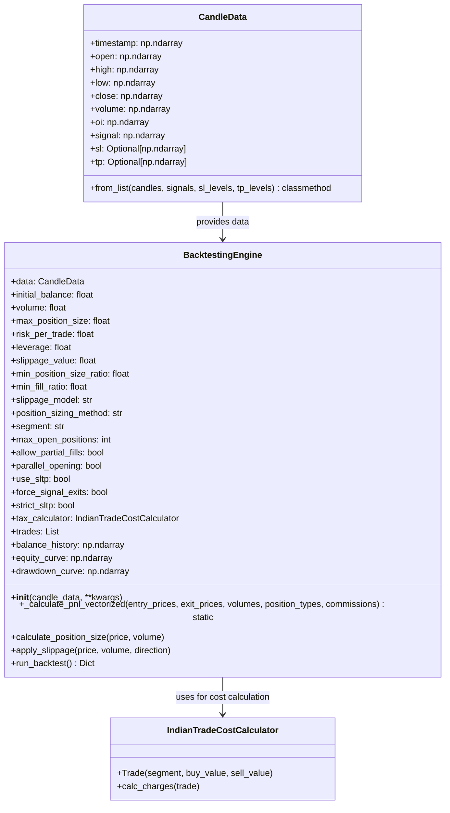
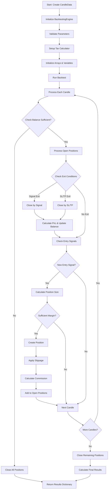
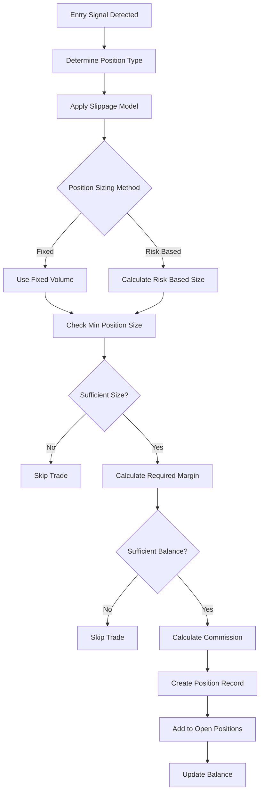
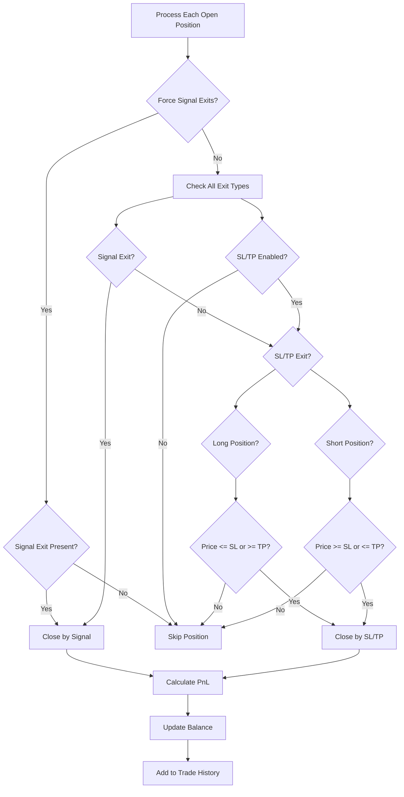
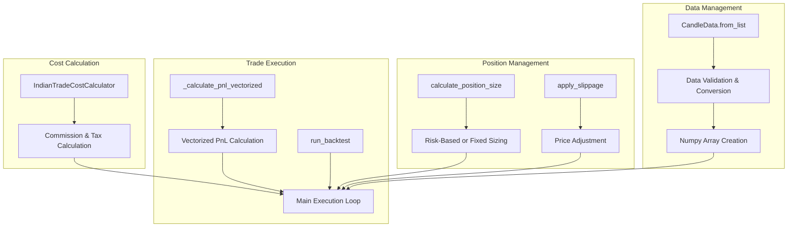
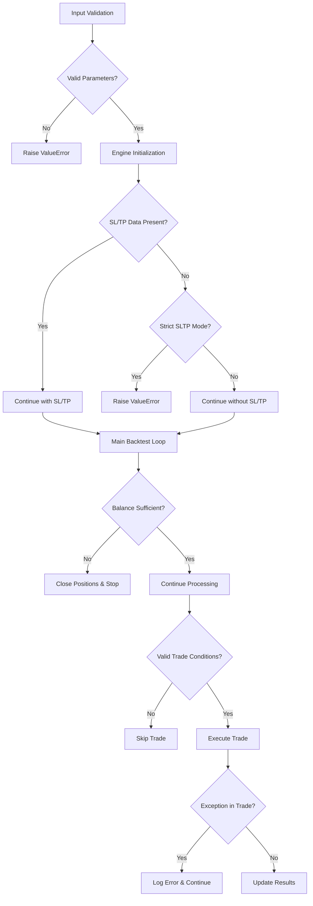
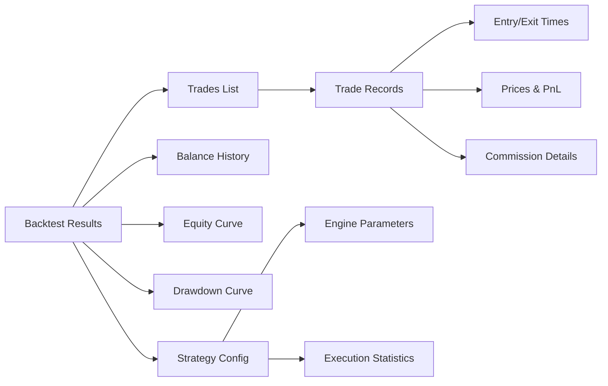

# Backward Testing Engine - Code Flow Visualization

## Main Class Structure and Data Flow

## Main Execution Flow

## Position Management Flow

## Exit Condition Logic

## Data Processing Pipeline

```mermaid
flowchart LR
    A[Raw Candle Data] --> B[Data Validation]
    B --> C[Convert to Numpy Arrays]
    C --> D[Extract Timestamps]
    D --> E[Convert Price Data]
    E --> F[Process Signals]
    F --> G[Process SL/TP Levels]
    G --> H[CandleData Object]
    
    H --> I[BacktestingEngine]
    I --> J[Vectorized Operations]
    J --> K[Trade Execution]
    K --> L[Results Collection]
```

## Key Methods and Their Purposes

## Error Handling and Validation Flow

## Results Structure

